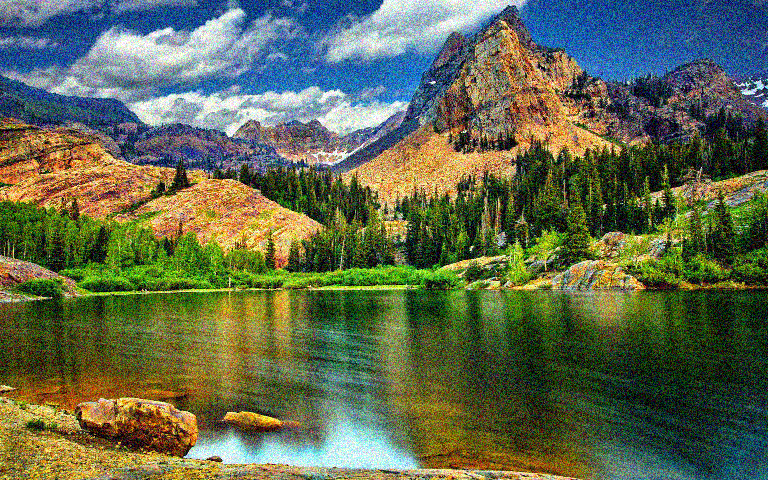
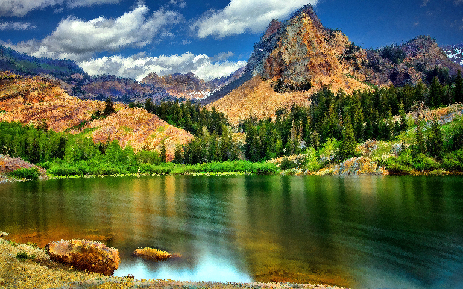
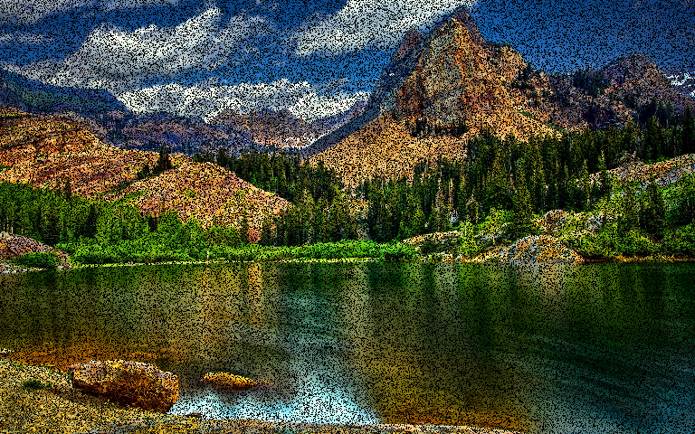
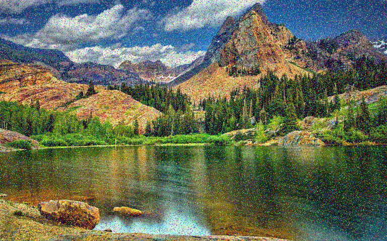
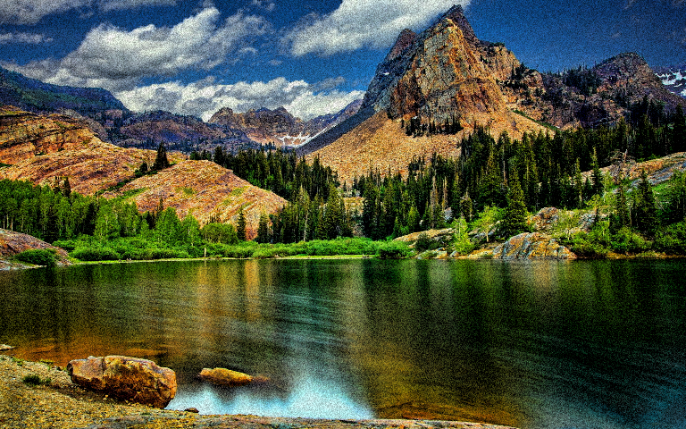

# Image augmentation package
Augmenting datasets of images is a common practice in training convolutional neural networks. Several methods for augmenting and degrading an image are implemented in this repository. This package can be used for modifying miages on-the-fly or modifying and storing them on disks.

The image in this repository is taken from [http://www.drodd.com/](http://www.drodd.com/images15/nature13.jpg)


## Requirements
This package depends on OpenCV and Numpy libraries.

## Examples
Following are result of degrading the above images using functions in *image_degrade* module.

### Gaussian noise
```python
im_noise = gaussian_noise(im,mu=0, sigma=30, sparse_prob=0.1)
```


### Uniform noise
```python
im_noise = uniform_noise(im, d_min=-60, d_max=60, sparse_prob=0.1)
```



### Gaussian noise (shared channels)
```python
im_noise = gaussian_noise_shared(im, mu=0, sigma=30, sparse_prob=0.1)
```


### Uniform noise (shared channels)
```python
im_noise = uniform_noise_shared(im, d_min=-60, d_max=60, sparse_prob=0.1)
```


### Pick noise

```python
im_noise = pick(im, 0.9, (5,5))
```


### Dropout
```python
im_noise = dropout(im, prob=0.3)
```


### Hurl noise
```python
im_noise = hurl(im, prob=0.2)
```


### Hue noise
```python
im_noise = hue(im, prob=0.1, d_min=-20,d_max=20)
```


### HSV noise (Uniform distribution, only on V component)
```python
im_noise = hsv_uniform(im, prob=0.1, d_min=-50,d_max=50,h_scale=0,s_scale=0,v_scale=1)
```


### HSV noise (Gaussian distribution, only on V component)
```python
im_noise = hsv_gaussian(im, prob=0.1, mue=-30, sigma=20, h_scale=0, s_scale=0, v_scale=1)
```
